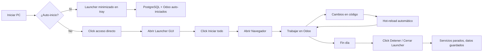

# 🏠 Odoo Inmobiliaria - App Windows 100% Local & Offline

Sistema inmobiliario completo ejecutándose **nativamente en Windows**, sin Docker, sin nube, sin internet requerida tras instalación.

---

## ✨ Características

| Característica | Estado |
|----------------|--------|
| ✅ 100% Local (sin Docker) | **LISTO** |
| ✅ Base de datos en tu PC | **LISTO** |
| ✅ Funciona 100% Offline | **LISTO** |
| ✅ Interfaz gráfica Windows | **LISTO** |
| ✅ Inicio automático opcional | **LISTO** |
| ✅ Hot-reload en desarrollo | **LISTO** |
| ✅ Instalador .exe standalone | **EN CONSTRUCCIÓN** |
| ✅ PostgreSQL portable incluido | **LISTO** |

---

## 🚀 Instalación Rápida (Desarrollo)

### Opción 1: Script automático (Recomendado)
```powershell
cd E:\proyectos\Odoo Flipping\odoo-19.0
python scripts/prepare_local.py
```
> Esto instala todo: PostgreSQL portable, dependencias Python, Odoo en modo desarrollo, crea BD, accesos directos.

### Opción 2: Manual
```powershell
# 1. Instalar dependencias
pip install -r launcher/requirements.txt
pip install -e odoo

# 2. Ejecutar launcher
python launcher/odoo_launcher.py
```

---

## 🖥️ Launcher GUI (Interfaz Gráfica)

Al ejecutar `python launcher/odoo_launcher.py` se abre:

```
┌─────────────────────────────────────────────┐
│  🏠 OdooInmobiliaria - Gestor Local        │
│  Sistema Inmobiliario 100% Local & Offline │
├─────────────────────────────────────────────┤
│ Estado de Servicios                         │
│ PostgreSQL: ● Ejecutándose  [Detener]      │
│ Odoo Server: ● Ejecutándose  [Detener]     │
│                         [🌐 Abrir Navegador]│
├─────────────────────────────────────────────┤
│ Registro de Actividad                       │
│ [10:30:15] Iniciando PostgreSQL...         │
│ [10:30:18] PostgreSQL listo en puerto 5433 │
│ [10:30:18] Iniciando Odoo...               │
│ [10:30:22] Odoo listo en puerto 8069       │
├─────────────────────────────────────────────┤
│ [⚙️ Config] [📁 Datos] [🔄 Reiniciar] [❌ Salir] │
└─────────────────────────────────────────────┘
```

### Funciones:
- **Iniciar/Detener** PostgreSQL y Odoo independientemente
- **Abrir Navegador** → abre `http://localhost:8069` automáticamente
- **Ver logs** en tiempo real con colores
- **Configuración** → muestra rutas, puertos, credenciales
- **Abrir Carpeta Datos** → abre `%APPDATA%\OdooInmobiliaria\`
- **Reiniciar Todo** → reinicia ambos servicios

---

## 📁 Estructura de Datos (Todo en tu PC)

```
%APPDATA%\OdooInmobiliaria\
├── data\
│   ├── postgresql\          # Cluster PostgreSQL (puerto 5433)
│   └── odoo\                # Filestore, sesiones, etc.
├── postgresql\              # Binarios PostgreSQL portable
│   └── bin\postgres.exe
├── addons\                  # Tus módulos personalizados
│   └── inmobiliaria_core\
├── config\odoo.conf         # Configuración resuelta
├── logs\
│   ├── launcher.log         # Logs del launcher
│   └── odoo.log             # Logs de Odoo
└── start_odoo.bat           # Script directo (sin GUI)
```

> **Ventaja**: Desinstalando la app, tus datos **permanecen intactos** en AppData.

---

## 🔧 Configuración Técnica

| Componente | Puerto | Usuario | Password | BD |
|------------|--------|---------|----------|-----|
| PostgreSQL | 5433 | odoo | odoo | inmobiliaria |
| Odoo | 8069 | valegchemes@gmail.com | Poloaco123! | - |

### ¿Por qué puerto 5433?
Evita conflictos si ya tienes PostgreSQL instalado en el puerto estándar 5432.

---

## 🛠️ Desarrollo Local

### Hot-Reload Automático
```powershell
# El launcher usa dev_mode=reload,qweb,werkzeug,xml
# Cambios en .py → Odoo recarga solo (3 seg)
# Cambios en .xml → Recarga al refrescar navegador (F5)
```

### Estructura de tu módulo:
```
%APPDATA%\OdooInmobiliaria\addons\inmobiliaria_core\
├── models/
│   ├── property.py          # Extiende real.estate.property
│   ├── offer.py             # Extiende ofertas
│   ├── amenity.py           # Amenities (pileta, gym, SUM...)
│   └── neighborhood.py      # Barrios con coords + stats
├── views/
│   ├── property_views.xml   # Form, Tree, Kanban, Search
│   ├── property_menu.xml    # Menús + Actions
│   └── wizard_views.xml     # Wizards contratos/contraofertas
├── wizards/
│   ├── contract_wizard.py   # Reserva/Boleto/Alquiler
│   └── counter_offer_wizard.py
├── data/demo_data.xml       # 20 amenities + 10 barrios CABA
└── security/ir.model.access.csv
```

### Agregar campo nuevo:
1. Edita `models/property.py` → añade campo
2. Edita `views/property_views.xml` → añade en form/tree
3. En Launcher: **Reiniciar Todo** → listo

---

## 📦 Compilar a .EXE Standalone (Distribución)

### Requisitos previos:
```powershell
pip install pyinstaller pillow
```

### Compilar:
```powershell
cd E:\proyectos\Odoo Flipping\odoo-19.0
python launcher/build_exe.py
```

### Resultado:
```
dist/OdooInmobiliaria.exe     (~80-120 MB)
├── Incluye: Python + Tkinter + psycopg2 + watchdog + Odoo deps
├── Copia junto al .exe: config/, addons/, README.md
└── Al ejecutar: extrae PostgreSQL portable a %APPDATA%\
```

### Crear Instalador .msi/.exe (Inno Setup):
```powershell
# 1. Instalar Inno Setup 6+
# 2. Compilar installer/setup.iss
# 3. Genera: OdooInmobiliaria_Setup_19.0.1.0.exe
```

---

## 🔄 Flujo de Trabajo Diario



---

## 🆘 Solución de Problemas

| Problema | Solución |
|----------|----------|
| `psycopg2` error | `pip install psycopg2-binary` |
| Puerto 5433 ocupado | Cambiar en `config/odoo_local.conf` y `start_odoo.bat` |
| `odoo-bin` no encontrado | `pip install -e E:\proyectos\Odoo Flipping\odoo-19.0\odoo` |
| BD no conecta | Verificar que PostgreSQL esté corriendo (botón verde en launcher) |
| Módulo no aparece | Apps → **Actualizar lista de Apps** → Buscar "Inmobiliaria Core" |
| Estilos SCSS rotos | Ignorar (warning menor), o `pip install libsass` |
| Permisos carpeta | Ejecutar como Admin una vez, o `icacls %APPDATA%\OdooInmobiliaria /grant Everyone:F /T` |

---

## 📋 Comandos Útiles

```powershell
# Ver logs en vivo
Get-Content "$env:APPDATA\OdooInmobiliaria\logs\odoo.log" -Wait -Tail 50

# Backup BD
"$env:APPDATA\OdooInmobiliaria\postgresql\bin\pg_dump.exe" -h localhost -p 5433 -U odoo inmobiliaria > backup.sql

# Restore BD
"$env:APPDATA\OdooInmobiliaria\postgresql\bin\psql.exe" -h localhost -p 5433 -U odoo -d inmobiliaria < backup.sql

# Reiniciar todo desde cero
Remove-Item "$env:APPDATA\OdooInmobiliaria\data" -Recurse -Force
python scripts/prepare_local.py
```

---

## 🎯 Próximos Pasos

1. **Compilar .exe** → `python launcher/build_exe.py`
2. **Crear instalador** → Abrir `installer/setup.iss` en Inno Setup → Build
3. **Probar en PC limpio** → Instalar → Verificar que funciona sin Python instalado
4. **Firmar código** (opcional) → Certificado EV para evitar SmartScreen
5. **Auto-actualizaciones** → Implementar check de versiones GitHub Releases

---

## 📞 Soporte

- **Logs**: `%APPDATA%\OdooInmobiliaria\logs\`
- **Config**: `%APPDATA%\OdooInmobiliaria\config\odoo.conf`
- **Datos**: `%APPDATA%\OdooInmobiliaria\data\`

---

**¡Tu sistema inmobiliario 100% tuyo, 100% local, 100% offline!** 🏠🔒